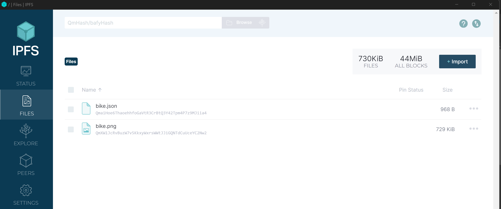
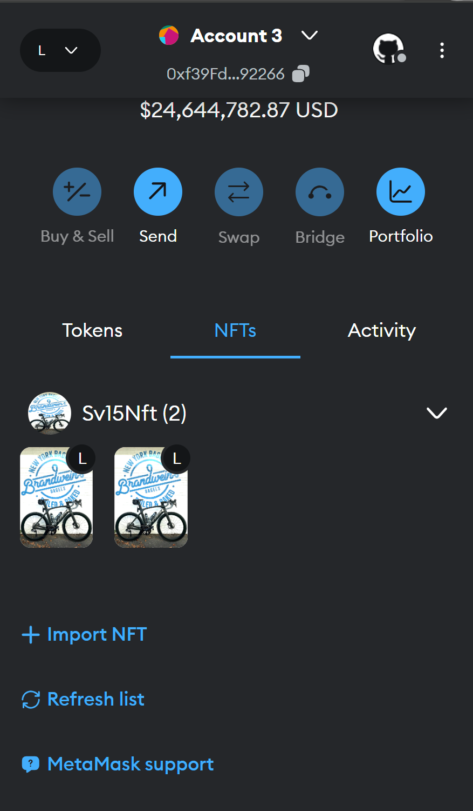

# Building our Own NFT (Non-Fungible Token)

As part of this test project, we are building our own [NFT](https://en.wikipedia.org/wiki/Non-fungible_token). And the NFT we have chosen to build is off the image of my road bike "Trek Madone" and named the token as Sv15Nft.

For building our own NFTs, we would leverage the [ERC721](https://docs.openzeppelin.com/contracts/3.x/erc721) implemented by `@openzeppelin/contracts/token/ERC721/ERC721.sol`.

## Step 1: Understanding IPFS and Uploading our image and metadata to IPFS

Read about the IPFS [here](https://docs.ipfs.tech/concepts/what-is-ipfs/). In order to upload the image and metadata to IPFS:

- We need to either install IPFS desktop OR a add-on to a web-browser. 
- Sample files we uploaded as part of this project are present in the img folder.
  - Once the image/file is uploaded, we get a IPFS URL for the same
    - Example:
      - Image file: <https://ipfs.io/ipfs/QmXW1JcRvBuzW7v5KkxyWxrsWWtJJiGQNTdCuUceYC2Nw2?filename=bike.png>
      - Metadata file: <https://ipfs.io/ipfs/QmaiHoe6ThaoehhfoGaVtR3CrBtQ3Y42Tpm4P7z9MJiia4?filename=bike.json>

**Sample Screenshots:**


## Step 2: Develop, Test, and Deploy the `Sv15Nft` Contract

### Write the Contract

First install the `Openzeppelin` contracts

```shell
forge install OpenZeppelin/openzeppelin-contracts --no-commit
```

Implement the contract by inheriting the `ERC721` contract from `Openzeppelin`.

```solidity
contract Sv15Nft is ERC721
```

and implement the `mint` and `tokenUri` functions. Check the `Sv15Nft.sol` for the implementations. Once done, build the project.

```shell
forge build

# OR if using Makefile
make build
```

### Test the Contract

Write tests to test the 2 functions added in the contract to ensure the NFT is minted as expected and also the correct tokenUri is returned with the tokenId is passed.

```shell
forge test

# OR if using Makefile
make test
```

### Deploy the Contract

Now, that we have written and unit tested the contract, its time to deploy it. In this example we will deploy to anvil localnet forked from the sepolia testnet.

#### Setup the Environment

Setup the `.env` file. Refer to the `.env.sample` file for the same.

#### Start the Local Anvil Chain

```shell
anvil --fork-url $INFURA_RPC_URL --fork-block-number $FORKED_BLOCK_NUMBER

# OR (If you don't want to fork the testnet or mainnet)
anvil
```

#### Deploy the Contract to Local Anvil Chain

```shell
# To check if the contract is ready to be deployed properly.
forge script script/DeploySv15Nft.s.sol:DeploySv15Nft --rpc-url $RPC_URL --private-key $PRIVATE_KEY

# To actually deploy the contract to the local net
forge script script/DeploySv15Nft.s.sol:DeploySv15Nft --rpc-url $RPC_URL --private-key $PRIVATE_KEY --broadcast

# OR if using Makefile (helps avoid writing the lengthy command over and over again)
make deploy
```

### Test the Deployed Contract

Create the `interactions.s.sol` file under the `script` folder to interact with the deployed contract.

We would need to get the latest deployed contract to interact with, for that we would leverage the `foundry-devops` package which we need to install using the below command.

```shell
# Used in interactions to always work with the latest version of the contract
forge install ChainAccelOrg/foundry-devops --no-commit
```

Check the code in the `interactions.s.sol` on how we are minting the NFT. Command to execute mint the NFT.

```shell
forge script script/Interactions.s.sol:MintSv15Nft --rpc-url $RPC_URL --private-key $PRIVATE_KEY --broadcast

# OR if using Makefile (helps avoid writing the lengthy command over and over again)
make mint
```

### Import the NFT in the Metamask Wallet

- Go to the Metamask wallet.
- Select the Test Anvil Network.
- Select the Test Anvil Account >  Go to the NFTs section > Click on Import NFT.
- Enter the contract address and the tokenId.

Congratulations, your token is added to your account in the wallet.



**NOTE**: For this step to work, your local IPFS instance needs to be up and running OR else you might not be able to complete these steps.
